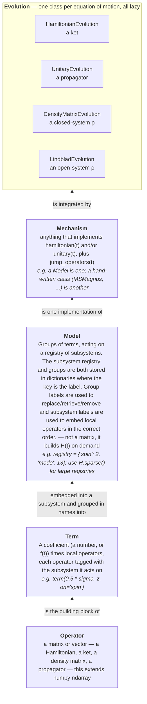

# htdse

NOTE: Written with significant help from AI (Claude). Built over many revisions, stemming from human design.

A framework for a recurring physics problem: you have a **target** (what a system is
*supposed* to do) and a **mechanism** that produces the **realized** dynamics from actual
experimental parameters — Trotterization, motional coupling, shaped pulses, dissipation.
htdse lets you compose both from named pieces, evolve them, and measure how reality
deviates from the target, without rewriting the TDSE/comparison/plotting scaffolding for
every experiment.

## Install

```
pip install -e .
```

## Quickstart

A Rabi drive, and the same drive with a 5% amplitude error plus a stray detuning —
composed, evolved, and compared in ~15 lines:

```python
import numpy as np
import htdse as ht
from htdse.submodules.spin import sigma_x, sigma_z

target = ht.term(0.5 * sigma_x, on="q", name="drive")          # H = (Omega/2) sigma_x

noisy = (ht.term(0.5 * 1.05 * sigma_x, on="q", name="drive")   # 5% amplitude error
         + ht.term(0.02 * sigma_z, on="q", name="detuning"))   # + stray detuning
realized = target.replace(drive=noisy)                          # same model, one group swapped

ts = np.linspace(0, 4 * np.pi, 200)
with ht.quiet():
    F = ht.compare_over(ts,
                        ht.HamiltonianEvolution(target, ht.ket("0")),
                        ht.HamiltonianEvolution(realized, ht.ket("0")),
                        metric=ht.fidelity)
print(f"worst-case fidelity: {F.min():.4f}")
```

That's the whole shape of the package: build a model out of *named* terms, swap the
error-bearing pieces in with `replace()`, evolve both sides, compare with an explicit
metric. [GUIDE.md](GUIDE.md) walks through each step; every demo notebook is a variation
on this loop.

## The hierarchy

Everything in the package is one of five kinds of object, stacked. Lower layers are the
ingredients of the ones above:



The load-bearing idea is the **subsystem name**: two operators tagged `"spin"` act on the
same tensor factor, so `+` lines them up and identity-pads automatically — you never write
`⊗ I` by hand, and the joint matrix only exists when an evolution asks for `H(t)`.

```python
atom = term(0.5 * w0 * sigma_z, on="spin", name="atom")
mode = term(w * number_op,      on="mode", name="mode")
jc   = hconj(term({"spin": sigma_plus, "mode": a}, coeff=g, name="jc"))  # g s+ a + h.c.
H    = atom + mode + jc      # Jaynes–Cummings; names did the embedding
```

For large Hilbert spaces (many ions / large Fock truncations), `H.sparse()` switches the
materialization to scipy CSR — same physics, and it is what makes 10⁴–10⁵-dimensional
ket evolutions feasible.

## Where to go

| You want | Go to |
|---|---|
| To run your first simulation, step by step | [GUIDE.md](GUIDE.md) |
| The physics and numerics under the hood (the transparent-package document) | [PHYSICS.md](PHYSICS.md) |
| Worked examples, in order of increasing complexity | [demos/](demos/) |
| What a function does exactly | its docstring — they are written as the reference manual |

**Package layout**

```
src/htdse/
  core/            # Operator, Mechanism, terms (composable Models), the four
                   # evolution classes, embed/partial_trace, compare_over, plotting
  submodules/      # reusable physics: spin (Paulis, pauli_sum), harmonic_oscillator,
                   # trotter, molmer_sorensen (MS gate suite), wigner
  util.py          # otimes, ket, fidelity, projector, ...
demos/             # worked notebooks (start at 00)
tests/             # python tests/test_htdse.py ; python tests/test_molmer_sorensen.py
```
