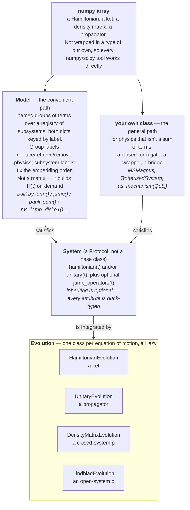

# htdse

NOTE: Written with significant help from AI (Claude). Built over many revisions, stemming from human design.

A small, transparent time-dependent Schrödinger/Lindblad solver.

- **Transparent.** No wrapper types. You hand it numpy arrays and get numpy arrays back
  (scipy CSR if you asked for sparse). Every intermediate is inspectable, and every
  approximation is a constructor argument rather than a hidden default.
- **Lightweight.** numpy, scipy, matplotlib. ~3.5k lines. You can read all of it.
- **Extensible.** A `System` is anything with `hamiltonian(t)` (or `unitary(t)`). That is
  the whole protocol — writing your own submodule means writing physics, not plumbing.

It composes Hamiltonians from *named* pieces, so building a variant of a model (with an
error term, a swapped drive, a different approximation) is a one-line edit rather than a
rewrite. Comparing the variant to the original is what most of the package is for.

## Install

```
pip install -e .
```

## Quickstart

A Rabi drive, and the same drive with a 5% amplitude error plus a stray detuning:

```python
import numpy as np
import htdse as ht
from htdse.submodules.spin import sigma_x, sigma_z

target = ht.term(0.5 * sigma_x, on="q", name="drive")          # H = (Omega/2) sigma_x

noisy = (ht.term(0.5 * 1.05 * sigma_x, on="q", name="drive")   # 5% amplitude error
         + ht.term(0.02 * sigma_z, on="q", name="detuning"))   # + stray detuning
realized = target.replace(drive=noisy)                          # same model, one group swapped

ts = np.linspace(0, 4 * np.pi, 200)
with ht.quiet():
    F = ht.compare_over(ts,
                        ht.HamiltonianEvolution(target, ht.ket("0")),
                        ht.HamiltonianEvolution(realized, ht.ket("0")),
                        metric=ht.fidelity)
print(f"worst-case fidelity: {F.min():.4f}")
```

## The five things you need

The package exports about thirty names. These five cover most work; everything else is
either a convenience or an escape hatch you will find when you need it.

| | |
|---|---|
| `ht.term(op, on="name")` | one piece of a Hamiltonian, tagged with the subsystem it acts on |
| `+` | compose pieces into a `Model` (names do the tensor bookkeeping) |
| `ht.HamiltonianEvolution(model, psi0)` | solve it (or `Unitary` / `DensityMatrix` / `Lindblad`) |
| `.state_at(t)` | the answer, at a time or an array of times |
| `ht.fidelity(a, b)` | compare two answers |

## The hierarchy

**You evolve a System.** That is the one sentence to remember. A `System` is anything that
answers "what are the dynamics at time `t`?" — it implements `hamiltonian(t)` and/or
`unitary(t)`. Nothing else is required.

`Model` is not a layer above or below that. It is one *convenient way* to build a System:
you write your physics as a sum of named terms and it handles the tensor bookkeeping,
caching, and swapping for you. A hand-written class is the other way, for physics that
isn't a sum of terms.


```mermaid
%%{init: {"flowchart": {"rankSpacing": 50, "nodeSpacing": 40}}}%%
flowchart TB
    OP["<b>numpy array</b><br/>a Hamiltonian, a ket, a density matrix, a propagator.<br/>Not wrapped in a type of our own, so every numpy/scipy tool works directly"]

    MODEL["<b>Model</b> — the convenient path<br/>named groups of terms over a registry of subsystems, both dicts keyed by label.<br/>Group labels replace/retrieve/remove physics; subsystem labels fix the embedding order.<br/>Not a matrix — it builds H(t) on demand<br/><i>built by term() / jump() / pauli_sum() / ms_lamb_dicke1() ...</i>"]

    OWN["<b>your own class</b> — the general path<br/>for physics that isn't a sum of terms:<br/>a closed-form gate, a wrapper, a bridge<br/><i>MSMagnus, TrotterizedSystem, as_mechanism(Qobj)</i>"]

    SYS["<b>System</b> (a Protocol, not a base class)<br/>hamiltonian(t) and/or unitary(t), plus optional jump_operators(t)<br/><i>inheriting is optional — every attribute is duck-typed</i>"]

    subgraph EVO["<b>Evolution</b> — one class per equation of motion, all lazy"]
        direction LR
        E1["HamiltonianEvolution<br/>a ket"]
        E2["UnitaryEvolution<br/>a propagator"]
        E3["DensityMatrixEvolution<br/>a closed-system ρ"]
        E4["LindbladEvolution<br/>an open-system ρ"]
    end

    OP --> MODEL
    OP --> OWN
    MODEL -- "satisfies" --> SYS
    OWN -- "satisfies" --> SYS
    SYS -- "is integrated by" --> EVO
```

Internally a `Model` stores each summand as a private `_Term`, because a coefficient that
is `f(t)` can't be folded into a matrix until you know `t`. You never construct or see one.

The load-bearing idea in the `Model` path is the **subsystem name**. Two operators tagged
`"spin"` act on the same tensor factor, so `+` lines them up and identity-pads
automatically. You never write `⊗ I` by hand, and no joint matrix exists until an evolution
asks for `H(t)`.

```python
atom = term(0.5 * w0 * sigma_z, on="spin", name="atom")
mode = term(w * number_op,      on="mode", name="mode")
jc   = plus_hc(term({"spin": sigma_plus, "mode": a}, coeff=g, name="jc"))  # g s+ a + h.c.
H    = atom + mode + jc      # Jaynes–Cummings; names did the embedding
```

## Extending it

Two ways to build a System, and the common one is **not** object-oriented:

| Your physics is… | You write… | Examples in the package |
|---|---|---|
| a sum of named pieces | **a function returning a `Model`** | `ms_lamb_dicke1`, `pauli_sum`, `term`, `jump` |
| a closed-form `U(t)`, or a wrapper | **a class satisfying `System`** | `MSMagnus`, `TrotterizedSystem`, `as_mechanism` |

A builder function is a plain function. Parameters live in its arguments, not in object
state, and you get the whole `Model` feature set for free:

```python
def my_drive(Omega, eps, delta) -> ht.Model:
    return (ht.term(0.5 * Omega * (1 + eps) * sigma_x, on="q", name="drive")
            + ht.term(delta * sigma_z, on="q", name="detuning"))
```

Call it with different arguments to get a different System. You never mutate one — which
matters, because an evolution freezes its System at binding and rejects later edits.

When the physics isn't a sum of terms, write the class:

```python
class RabiDrive(ht.System):
    def __init__(self, Omega):
        self.Omega = Omega
    def hamiltonian(self, t):
        return 0.5 * self.Omega * sigma_x      # a numpy array. That's it.
```

That is enough to be evolved, compared, Trotterized, and plotted by everything else. A
System whose physics is a *gate* implements `unitary(t)` instead and skips the ODE
entirely; one with dissipation adds `jump_operators(t)`. Two optional hints —
`breakpoints()` and `piecewise_constant` — tell the solver where `H(t)` jumps and whether
it is constant between jumps.

Inheriting `ht.System` is optional: it's a `Protocol`, and the evolutions duck-type every
attribute they read. Subclassing buys you the `H()` alias, a readable `__repr__`, and clear
errors instead of `AttributeError`.

**What the class route costs you.** Less than you'd think. Sparse still works — the solver
branches on whether the matrix *you returned* is sparse, so return a CSR and you get the
sparse path. The truncation guard still works — expose a `subsystems` dict (as `MSMagnus`
does) or pass `subsystems=` to the evolution. What you give up is the `Model` algebra: `+`,
`.replace()`, `.without()`, automatic identity padding, and the materialization cache. For
a closed-form `U(t)` most of that is moot anyway, and `embed()` is still available à la carte.

Everything in `submodules/` is written against this same protocol, with no privileged
access. `molmer_sorensen` is the largest example if you want a template.

## Guards

The solver refuses several things instead of silently returning a plausible wrong answer:
a non-Hermitian `H`, an invalid `rho0`, a dissipative system handed to a closed-system
solver, integration across a declared discontinuity, extrapolation past solved data, and a
system mutated after binding. Population reaching the top of a truncated ladder raises a
`TruncationWarning`. See [GUIDE.md](GUIDE.md#checking-a-run).

## Where to go

| You want | Go to |
|---|---|
| To run your first simulation, step by step | [GUIDE.md](GUIDE.md) |
| The physics and numerics under the hood | [PHYSICS.md](PHYSICS.md) |
| Worked examples, increasing complexity | [demos/](demos/) |
| To use QuTiP for part of the job | `htdse.interop.qutip` — [GUIDE.md](GUIDE.md#talking-to-qutip) |
| What a function does exactly | its docstring — written as the reference manual |
| To update code written against an older version | [MIGRATION.md](MIGRATION.md) |

**Package layout**

```
src/htdse/
  core/            # System protocol, terms (composable Models), the four evolution
                   # classes, embed/partial_trace, compare_over, converged,
                   # truncation guard, plotting
  interop/         # optional bridges (qutip), imported lazily, never a dependency
  submodules/      # reusable physics: spin, harmonic_oscillator, trotter,
                   # molmer_sorensen (MS gate suite), wigner
  magnus.py        # magnus / magnus_pauli: what a pulse effectively generates
  util.py          # otimes, ket, fidelity, sampled_pulse, ...
demos/             # worked notebooks (start at 00)
tests/             # python tests/test_htdse.py ; python tests/test_molmer_sorensen.py
```
