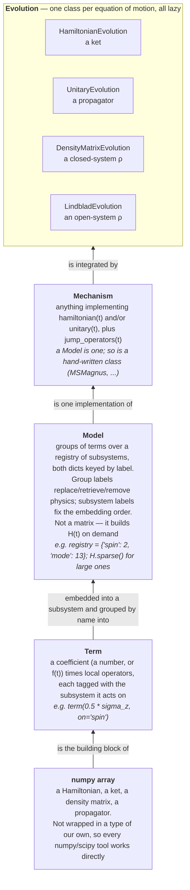

# htdse

NOTE: Written with significant help from AI (Claude). Built over many revisions, stemming from human design.

A small, transparent time-dependent Schrödinger/Lindblad solver.

- **Transparent.** No wrapper types. You hand it numpy arrays and get numpy arrays back
  (scipy CSR if you asked for sparse). Every intermediate is inspectable, and every
  approximation is a constructor argument rather than a hidden default.
- **Lightweight.** numpy, scipy, matplotlib. ~3.5k lines. You can read all of it.
- **Extensible.** A mechanism is any object with `hamiltonian(t)`. That is the whole
  protocol — writing your own submodule means writing physics, not plumbing.

It composes Hamiltonians from *named* pieces, so building a variant of a model (with an
error term, a swapped drive, a different approximation) is a one-line edit rather than a
rewrite. Comparing the variant to the original is what most of the package is for.

## Install

```
pip install -e .
```

## Quickstart

A Rabi drive, and the same drive with a 5% amplitude error plus a stray detuning:

```python
import numpy as np
import htdse as ht
from htdse.submodules.spin import sigma_x, sigma_z

target = ht.term(0.5 * sigma_x, on="q", name="drive")          # H = (Omega/2) sigma_x

noisy = (ht.term(0.5 * 1.05 * sigma_x, on="q", name="drive")   # 5% amplitude error
         + ht.term(0.02 * sigma_z, on="q", name="detuning"))   # + stray detuning
realized = target.replace(drive=noisy)                          # same model, one group swapped

ts = np.linspace(0, 4 * np.pi, 200)
with ht.quiet():
    F = ht.compare_over(ts,
                        ht.HamiltonianEvolution(target, ht.ket("0")),
                        ht.HamiltonianEvolution(realized, ht.ket("0")),
                        metric=ht.fidelity)
print(f"worst-case fidelity: {F.min():.4f}")
```

## The five things you need

The package exports about thirty names. These five cover most work; everything else is
either a convenience or an escape hatch you will find when you need it.

| | |
|---|---|
| `ht.term(op, on="name")` | one piece of a Hamiltonian, tagged with the subsystem it acts on |
| `+` | compose pieces into a `Model` (names do the tensor bookkeeping) |
| `ht.HamiltonianEvolution(model, psi0)` | solve it (or `Unitary` / `DensityMatrix` / `Lindblad`) |
| `.state_at(t)` | the answer, at a time or an array of times |
| `ht.fidelity(a, b)` | compare two answers |

## The hierarchy

Five kinds of object, stacked. Lower layers are the ingredients of the ones above:


```mermaid
%%{init: {"flowchart": {"rankSpacing": 60, "nodeSpacing": 50}}}%%
flowchart BT
    OP["<b>numpy array</b><br/>a Hamiltonian, a ket, a density matrix, a propagator.<br/>Not wrapped in a type of our own, so every numpy/scipy tool works directly"]

    TERM["<b>Term</b><br/>a coefficient (a number, or f(t)) times local operators,<br/>each tagged with the subsystem it acts on<br/><i>e.g. term(0.5 * sigma_z, on='spin')</i>"]

    MODEL["<b>Model</b><br/>groups of terms over a registry of subsystems, both dicts keyed by label.<br/>Group labels replace/retrieve/remove physics; subsystem labels fix the embedding order.<br/>Not a matrix — it builds H(t) on demand<br/><i>e.g. registry = {'spin': 2, 'mode': 13}; H.sparse() for large ones</i>"]

    MECH["<b>Mechanism</b><br/>anything implementing hamiltonian(t) and/or unitary(t), plus jump_operators(t)<br/><i>a Model is one; so is a hand-written class (MSMagnus, ...)</i>"]

    subgraph EVO["<b>Evolution</b> — one class per equation of motion, all lazy"]
        direction LR
        E1["HamiltonianEvolution<br/>a ket"]
        E2["UnitaryEvolution<br/>a propagator"]
        E3["DensityMatrixEvolution<br/>a closed-system ρ"]
        E4["LindbladEvolution<br/>an open-system ρ"]
    end

    OP -- "is the building block of" --> TERM
    TERM -- "embedded into a subsystem and grouped by name into" --> MODEL
    MODEL -- "is one implementation of" --> MECH
    MECH -- "is integrated by" --> EVO
```

The load-bearing idea is the **subsystem name**. Two operators tagged `"spin"` act on the
same tensor factor, so `+` lines them up and identity-pads automatically. You never write
`⊗ I` by hand, and no joint matrix exists until an evolution asks for `H(t)`.

```python
atom = term(0.5 * w0 * sigma_z, on="spin", name="atom")
mode = term(w * number_op,      on="mode", name="mode")
jc   = plus_hc(term({"spin": sigma_plus, "mode": a}, coeff=g, name="jc"))  # g s+ a + h.c.
H    = atom + mode + jc      # Jaynes–Cummings; names did the embedding
```

## Extending it

The `Mechanism` protocol is three optional methods. Implement whichever your physics
naturally gives:

```python
class RabiDrive(ht.Mechanism):
    def __init__(self, Omega):
        self.Omega = Omega
    def hamiltonian(self, t):
        return 0.5 * self.Omega * sigma_x      # a numpy array. That's it.
```

That is enough to be evolved, compared, Trotterized, and plotted by everything else. A
mechanism whose physics is a *gate* implements `unitary(t)` instead and skips the ODE
entirely; one with dissipation adds `jump_operators(t)`. Two optional hints — `breakpoints()`
and `piecewise_constant` — tell the solver where `H(t)` jumps and whether it is constant
between jumps.

Everything in `submodules/` is written against this same protocol, with no privileged
access. `molmer_sorensen` is the largest example if you want a template.

## Guards

The solver refuses several things instead of silently returning a plausible wrong answer:
a non-Hermitian `H`, an invalid `rho0`, a dissipative mechanism handed to a closed-system
solver, integration across a declared discontinuity, extrapolation past solved data, and a
mechanism mutated after binding. Population reaching the top of a truncated ladder raises a
`TruncationWarning`. See [GUIDE.md](GUIDE.md#checking-a-run).

## Where to go

| You want | Go to |
|---|---|
| To run your first simulation, step by step | [GUIDE.md](GUIDE.md) |
| The physics and numerics under the hood | [PHYSICS.md](PHYSICS.md) |
| Worked examples, increasing complexity | [demos/](demos/) |
| To use QuTiP for part of the job | `htdse.interop.qutip` — [GUIDE.md](GUIDE.md#talking-to-qutip) |
| What a function does exactly | its docstring — written as the reference manual |

**Package layout**

```
src/htdse/
  core/            # Mechanism, terms (composable Models), the four evolution
                   # classes, embed/partial_trace, compare_over, converged,
                   # truncation guard, plotting
  interop/         # optional bridges (qutip), imported lazily, never a dependency
  submodules/      # reusable physics: spin, harmonic_oscillator, trotter,
                   # molmer_sorensen (MS gate suite), wigner
  magnus.py        # magnus / magnus_pauli: what a pulse effectively generates
  util.py          # otimes, ket, fidelity, sampled_pulse, ...
demos/             # worked notebooks (start at 00)
tests/             # python tests/test_htdse.py ; python tests/test_molmer_sorensen.py
```
