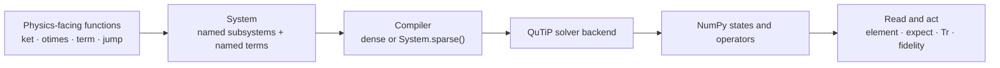

# htdse

`htdse` is a functional, physics-readable layer for building and evolving
Hamiltonians. You describe named subsystems and physical terms, it is evolved numerically with QuTiP,
and everything you interface with remains as a NumPy array.

## Install

```text
pip install -e .
```

Python 3.10 or newer is required. NumPy, SciPy, Matplotlib, and QuTiP 5.1 or
newer are installed as dependencies.

> **Note:** Written with significant help from AI (Claude). Built over many
> revisions, stemming from human design.

## Design

- **Physics-readable.** `ket`, `otimes`, `dag`, `Tr`, `term`, `evolve`, and
  `apply_unitary` keep the code close to pencil-and-paper notation.
- **Functional rather than object-oriented.** Most work is done by composing
  values with functions.
- **Composable and immutable.** Named Hamiltonian pieces can be added, removed,
  or replaced without modifying the original `System`.
- **Backend-light at the surface.** Public states and operators are NumPy arrays.
  QuTiP objects and sparse matrix implementations remain implementation details.

## Usage Overview

The core of `htdse` is small: a subsystem dictionary describes the Hilbert
space, a `System` describes the dynamics on it, and an evolution produces the
state at a requested time. Physics-notation functions operate on the resulting
NumPy arrays. The examples use `import numpy as np` and `import htdse as ht`.


```mermaid
flowchart LR
    F["Physics-facing functions<br/>ket · otimes · term · jump"] --> S["System<br/>named subsystems + named terms"]
    S --> C["Compiler<br/>dense or System.sparse()"]
    C --> Q["QuTiP solver backend"]
    Q --> N["NumPy states and operators"]
    N --> R["Read and act<br/>element · expect · Tr · fidelity"]
```

### Subsystem dictionary

A subsystem is one physical factor of the Hilbert space: a spin, motional mode,
cavity mode, atom, or anything else with a finite working dimension. The
subsystem dictionary maps each physical name to that dimension:

```python
n_max = 8
subsystems = {"spin": 2, "motion": n_max + 1}
```

The dictionary means

$$
\mathcal H = \mathcal H_{\mathrm{spin}} \otimes
             \mathcal H_{\mathrm{motion}},
\qquad \dim\mathcal H = 2(n_{\max}+1).
$$

The insertion order fixes the tensor-product order. Here, a joint vector is
read as spin $\otimes$ motion, not motion $\otimes$ spin. This registry gives
`embed`, `apply_unitary`, `partial_trace`, and `element` enough information to
act on a named factor without manual identity padding or tensor reshaping.

### Systems and terms

A `System` is the complete, immutable description of $H(t)$ and any Lindblad
channels. It stores physical contributions rather than one permanent joint
matrix; tensor embedding and materialization happen when they are needed.

**Terms.** `term(...)` returns a one-contribution `System`, not a separate
public term object. `on=` names where an operator acts, `coeff=` is a scalar or
function of time, and `name=` labels the contribution.

```python
drive = ht.term(ht.sigma_x, on="spin", coeff=Omega / 2, name="drive")  # (Ω/2) σx
```

A dictionary of operators means a factored tensor product. A joint matrix that
does not factor can instead use `on=("a", "b")` with explicit `dims=`.

```python
coupling = ht.term({"spin": ht.sigma_plus, "motion": a}, coeff=g)  # g σ+ ⊗ a
joint = ht.term(A_ab, on=("a", "b"), dims={"a": 2, "b": 3})       # general Aab
```

The optional `frame=` tag documents the frame of a term and warns if terms
tagged with different frames are later combined.

**Composition and scaling.** Since every `term(...)` is itself a `System`, `+`
merges compatible contributions. `System(subsystems)` is simply an empty
system that pins the full subsystem set and tensor order; otherwise those are
inferred from the terms.

```python
H = ht.System(subsystems) + drive + coupling      # all three values are Systems
H_scaled = 0.5 * H                               # scales every Hamiltonian coefficient
H_shaped = H * envelope                          # envelope(t) scales every H term
H_difference = H1 - H2                           # coherent Systems may be subtracted
```

Addition, scaling, negation, subtraction, and all transformations return new
systems. Whole-system scaling, negation, and subtraction are rejected if jump
operators are present: $L$ enters a dissipator quadratically, so scaling the
Hamiltonian and scaling a decay rate are not the same operation.

**Named contributions and conveniences.** Names are handles for changing one
piece of the physics. `plus_hc` and `hc` express Hermitian conjugation without
materializing a matrix.

```python
interaction = ht.plus_hc(one_way)                # one_way + one_way†
realized = ht.replace(H, drive=erroneous_drive)  # replace one named contribution
bare = ht.without(H, "drive")                    # remove it
drive_only = ht.group(H, "drive")                # extract it as a System
```

Hermitian conjugation acts on Hamiltonian terms only. It does not invent a
conjugate dissipative channel: jumps pass through `plus_hc` once and are absent
from `hc`.

**Jumps and breakpoints.** `jump(...)` creates a named Lindblad contribution;
its coefficient should contain $\sqrt{\text{rate}}$. Breakpoints identify
times where a coefficient is discontinuous, forcing the solver to end one
integration segment and begin another exactly there.

```python
decay = ht.jump(ht.sigma_minus, on="spin", coeff=np.sqrt(gamma), name="decay")
H = ht.System(subsystems, breakpoints=[t_switch]) + drive + decay
```

**Inspection and storage.** The matrix at a particular time is available as
`H.H(t)` or `H.hamiltonian(t)`. Both return a NumPy array. The corresponding
jump matrices are `H.jump_operators(t)`.

```python
matrix = H.H(2.5)              # H(t=2.5)
ht.show(H, t=2.5)              # readable Pauli table or matrix
d = H.dim                      # total Hilbert-space dimension
edges = H.breakpoints()        # declared discontinuity times
H_sparse = H.sparse()          # same physics; sparse inside QuTiP
```

`H.subsystems` exposes the ordered registry. `repr(H)` summarizes its named
Hamiltonian and jump groups. `.sparse()` changes only internal solver storage;
inspection and evolution results remain NumPy arrays.

### Unitaries

Use `Unitary` when the physics gives $U(t)$ directly, rather than giving a
Hamiltonian that must be integrated. This is common for ideal gates and exact
closed-form solutions.

```python
x_rotation = ht.Unitary(
    lambda t: np.cos(Omega*t/2)*ht.I2 - 1j*np.sin(Omega*t/2)*ht.sigma_x,
    dim=2, subsystems={"spin": 2}, name="x rotation")
U = x_rotation(t)
psi_t = ht.apply_unitary(U, psi0)
```

`Unitary` values are immutable and expose both `U(t)` and `U.unitary(t)`.
`UnitaryEvolution` and `propagator` recognize them and return the analytic
answer without running an ODE solver.

### When fixed terms are not enough

Ordinary terms describe $H(t)=\sum_k f_k(t)A_k$: scalar coefficients vary in
time while the operator matrices $A_k$ remain fixed. This covers most drives.

Some physics changes the matrix itself with time—for example the exact
spin–motion displacement $e^{i\eta X(t)}$. Package builders such as
`exact_drive(...)` handle this internally and still return an ordinary
`System`; the user does not manage the callback or sparse matrices.

When implementing entirely new physics of this kind, an advanced user may pass
the evolution layer a small object providing `hamiltonian(t)`, plus an ordered
`subsystems` mapping. This whole-Hamiltonian callback is the escape hatch: it
loses named-term composition and is slower than fixed-matrix coefficient
compilation. Reusable physics belongs in a submodule builder so normal users
continue to receive a `System`.

### Evolution

Evolution combines a `System`, an initial state, and time.
`evolve(H, initial, times)` chooses the equation from the state:

- a ket uses the time-dependent Schrödinger equation;
- a density matrix without jumps uses unitary density-matrix evolution; and
- a density matrix with jumps uses the Lindblad master equation.

`evolve(...)` returns the NumPy state or trajectory directly. The explicit
`HamiltonianEvolution`, `UnitaryEvolution`, `DensityMatrixEvolution`, and
`LindbladEvolution` forms retain the solve and answer repeated `state_at(t)`
queries. They also expose `report()` for the numerical details of the solve.

### Physics-notation operations

All functions below are available through `import htdse as ht`; they are also
exported by `from htdse import *` for interactive calculations.

#### States and matrix elements

| Operation | Pure state $\lvert\psi\rangle$ | Density matrix $\rho$ |
| :--- | :--- | :--- |
| **Basis state** | $\lvert k\rangle$<br>`psi = ht.ket("1")` | $\lvert k\rangle\langle k\rvert$<br>`rho = ht.projector(ht.ket("1"))` |
| **General state** | $\lvert\psi\rangle=\sum_i c_i\lvert i\rangle$<br>`psi = c0*ht.ket("0") + c1*ht.ket("1")` | $\rho=\sum_i p_i\lvert\psi_i\rangle\langle\psi_i\rvert$<br>`rho = p0*ht.projector(psi0) + p1*ht.projector(psi1)` |
| **Coefficient or element** | $c_0=\langle0\vert\psi\rangle$<br>`c0 = ht.element(psi, "0")` | $\rho_{01}=\langle0\vert\rho\vert1\rangle$<br>`rho01 = ht.element(rho, "0", "1")`<br>For a pure state, $\rho_{01}=c_0c_1^*$. |
| **Local element** | $\langle0\vert\rho_s\vert1\rangle$, where $\rho_s=\operatorname{Tr}_m\lvert\psi\rangle\langle\psi\rvert$<br>`z = ht.element(psi, "0", "1", on="spin", subsystems=subsystems)` | $\langle0\vert\rho_s\vert1\rangle$<br>`z = ht.element(rho, "0", "1", on="spin", subsystems=subsystems)` |
| **Basis-state population** | $\lvert c_k\rvert^2$<br>`p = ht.population("1", psi)` | $\rho_{kk}$<br>`p = ht.population("1", rho)` |
| **Arbitrary-state population** | $\lvert\langle\phi\vert\psi\rangle\rvert^2$<br>`p = ht.population(phi, psi)` | $\langle\phi\vert\rho\vert\phi\rangle$<br>`p = ht.population(phi, rho)` |

`element(state, row, col=None, *, on=None, subsystems=None)` accepts an integer
index or a complete qubit bitstring. With `on=`, it traces out the other
subsystems first; one selector is then a local population and two select a
local coherence. For a trajectory, it returns one value per time.

#### Evolving and applying operators

| Operation | Pure state $\lvert\psi\rangle$ | Density matrix or operator $\rho,A$ |
| :--- | :--- | :--- |
| **Hamiltonian evolution** | $i\partial_t\lvert\psi\rangle=H(t)\lvert\psi\rangle$<br>`states = ht.evolve(H, psi0, times)` | $\dot\rho=-i[H,\rho]+\sum_k\mathcal D[L_k]\rho$<br>`states = ht.evolve(H, rho0, times)` |
| **Generated propagator** | $U(t)=\mathcal T e^{-i\int_0^tH(s)ds}$<br>`U = ht.propagator(H, t)` | $\rho(t)=U(t)\rho_0U^\dagger(t)$<br>`rho_t = ht.apply_unitary(U, rho0)` |
| **Known unitary** | $\lvert\psi'\rangle=U\lvert\psi\rangle$<br>`psi_next = U @ psi`<br>or `ht.apply_unitary(U, psi)` | $\rho'=U\rho U^\dagger$<br>`rho_next = U @ rho @ ht.dag(U)`<br>or `ht.apply_unitary(U, rho)` |
| **Transform an operator** | — | $A'=UAU^\dagger$<br>`A_next = ht.apply_unitary(U, A)` |
| **Apply locally** | $U_s\lvert\psi\rangle$<br>`ht.apply_unitary(U, psi, on="spin", subsystems=subsystems)` | $U_s\rho U_s^\dagger$<br>`ht.apply_unitary(U, rho, on="spin", subsystems=subsystems)` |
| **Change basis** | $\lvert\psi\rangle_{new}=V^\dagger\lvert\psi\rangle$<br>`psi_new = ht.change_basis(V, psi)` | $A_{new}=V^\dagger A V$<br>`A_new = ht.change_basis(V, A)` |

The columns of `V` are the new basis vectors. `apply_unitary` is an active
transformation; `change_basis` is a passive change of coordinates.

#### Operators and subsystems

| Operation | Pure state $\lvert\psi\rangle$ | Density matrix $\rho$ |
| :--- | :--- | :--- |
| **Expectation value** | $\langle A\rangle=\langle\psi\vert A\vert\psi\rangle$<br>`mean = ht.expect(A, psi)` | $\langle A\rangle=\operatorname{Tr}(A\rho)$<br>`mean = ht.Tr(A @ rho)`<br>or `ht.expect(A, rho)` |
| **Embed locally** | $A_s=A\otimes I_m$<br>`A_spin = ht.embed(A, on="spin", subsystems=subsystems)` | The same embedded operator acts on $\rho$. |
| **Tensor product** | $\lvert\psi_A\rangle\otimes\lvert\psi_B\rangle$<br>`psi = ht.otimes(psi_A, psi_B)` | $\rho_A\otimes\rho_B$<br>`rho = ht.otimes(rho_A, rho_B)` |
| **Discard a subsystem** | $\rho_A=\operatorname{Tr}_B\lvert\psi\rangle\langle\psi\rvert$<br>`rho_A = ht.partial_trace(psi, subsystems, "B")` | $\rho_A=\operatorname{Tr}_B(\rho)$<br>`rho_A = ht.partial_trace(rho, subsystems, "B")` |

#### Measurement

| Operation | Pure state $\lvert\psi\rangle$ | Density matrix $\rho$ |
| :--- | :--- | :--- |
| **Projective outcome** | $p=\langle\psi\vert P\vert\psi\rangle$, $\lvert\psi'\rangle=P\lvert\psi\rangle/\sqrt p$<br>`post, p = ht.measure(P, psi)` | $p=\operatorname{Tr}(P\rho)$, $\rho'=P\rho P/p$<br>`post, p = ht.measure(P, rho)` |
| **POVM probabilities** | $p_k=\langle\psi\vert E_k\vert\psi\rangle$<br>`ps = [ht.expect(E, psi) for E in effects]` | $p_k=\operatorname{Tr}(E_k\rho)$<br>`ps = [ht.Tr(E @ rho) for E in effects]` |
| **General outcome** | $p_k=\lVert M_k\lvert\psi\rangle\rVert^2$<br>`post, p = ht.measure(M_k, psi)` | $p_k=\operatorname{Tr}(M_k^\dagger M_k\rho)$<br>`post, p = ht.measure(M_k, rho)` |

Add `on=` and `subsystems=` to `measure` for a local outcome. POVM effects
$E_k$ determine probabilities but not a unique post-measurement state; supply
a measurement operator $M_k$ with $E_k=M_k^\dagger M_k$ when conditioning on
an outcome.

#### Comparing states

| Operation | Pure state $\lvert\psi\rangle$ | Density matrix $\rho$ |
| :--- | :--- | :--- |
| **Overlap** | $\langle\phi\vert\psi\rangle$<br>`z = ht.overlap(phi, psi)` | $\operatorname{Tr}(\sigma\rho)$<br>`z = ht.Tr(sigma @ rho)` |
| **Fidelity** | $F=\lvert\langle\phi\vert\psi\rangle\rvert^2$<br>`F = ht.fidelity(phi, psi)` | $F=(\operatorname{Tr}\sqrt{\sqrt\sigma\rho\sqrt\sigma})^2$<br>`F = ht.fidelity(sigma, rho)` |
| **Distance** | $\sqrt{1-F}$<br>`d = ht.distance(phi, psi)` | $\frac12\lVert\sigma-\rho\rVert_1$<br>`d = ht.distance(sigma, rho)` |
| **Relative phase of states** | $\arg\langle\phi\vert\psi\rangle$<br>`phase = ht.relative_phase(phi, psi)` | Global phase is not present in a density matrix. |
| **Relative phase of components** | $\arg(c_jc_k^*)$<br>`phase = np.angle(c_j * c_k.conj())` | $\arg(\rho_{jk})$<br>`phase = np.angle(rho[j, k])` |

### A complete calculation

An ideal Rabi drive and a drive with amplitude and detuning errors use the same
small vocabulary:

```python
import numpy as np
import htdse as ht

# Define rabi frequency, amplitude error, detuning error
Omega, epsilon, delta = 1.0, 0.05, 0.02
# Define hilbert space
subsystems = {"spin": 2}
# Define hamiltonians as systems
ideal = (ht.System(subsystems)
         + ht.term(0.5 * Omega * ht.sigma_x, on="spin", name="drive"))
erroneous_drive = (ht.term(0.5 * Omega * (1 + epsilon) * ht.sigma_x, on="spin") # amplitude error
                   + ht.term(delta * ht.sigma_z, on="spin")) # detuning error
# Swapping terms ideal -> erroneous
realized = ht.replace(ideal, drive=erroneous_drive)

times = np.linspace(0, 4 * np.pi / Omega, 201)
# Evolve the ideal and erroneous
psi_ideal = ht.evolve(ideal, ht.ket("0"), times)
psi_realized = ht.evolve(realized, ht.ket("0"), times)
# Calculate the fidelity over all times
fidelity = np.array([ht.fidelity(a, b) for a, b in zip(psi_ideal, psi_realized)])
```

## Numerical guardrails

- Hamiltonians are checked for Hermiticity before evolution.
- Invalid density matrices are rejected, as are closed-system solvers given
  Lindblad jump operators.
- Discontinuities declared as breakpoints are included in every solve, so an
  adaptive integrator cannot step across them unnoticed.
- Significant population at the top of a truncated Fock space raises
  `TruncationWarning`.
- Bound evolution objects reject later mutation of private dynamics providers.
- `report()` records the QuTiP backend, tolerances, solved range, truncation,
  trace, and unitarity diagnostics.
- Frame tags can warn when terms written in incompatible frames are combined;
  the package cannot determine the correct physical frame for you.

Storage is deliberately not user-facing. A large, structurally sparse `System`
emits one suggestion; calling `.sparse()` is the single optional override.
QuTiP then keeps the compiled operators sparse internally, while results remain
NumPy arrays. For QuTiP-specific work such as `mcsolve` or `steadystate`,
`htdse.interop.qutip.to_qutip` is the explicit escape hatch.

## Physics submodules

Submodules separate platform-specific vocabulary and approximations from the
generic engine: sideband order belongs to trapped-ion physics, while blockade
radius belongs to Rydberg physics. Their builders return the same `System`,
NumPy arrays, or immutable instruction values used by the core.

Use `import htdse as ht` for common names such as `ht.fock` and `ht.ms_tones`.
Use a module namespace—`ht.spin_boson.driven_spins`, for example—when the
context helps. `help(ht.spin_boson)` and the demos document conventions and
show how the pieces fit together.

- **`spin`** — Pauli operators, Pauli terms, and compact Pauli-sum parsing for
  spin-$1/2$ systems.
- **`spin_j`** — angular-momentum and ladder operators for arbitrary spin $J$.
- **`harmonic_oscillator`** — ladder and number operators, Fock and thermal
  states, and thermal motional decoherence.
- **`spin_boson`** — carrier and sideband drives, exact/Lamb–Dicke/RWA
  approximation choices, and Jaynes–Cummings and quantum Rabi systems.
- **`trapped_ion`** — immutable ion-chain descriptions and pulse sequences;
  physical `tone`, `wait`, `rx`, `ry`, `rz`, and `rxx` instructions compile to
  the ordinary dynamics layer.
- **`molmer_sorensen`** — symmetric MS tones, the closed-form post-RWA Magnus
  solution, ideal gates, and phase-space diagnostics.
- **`trap`** — Lamb–Dicke parameters, motional sideband matrix elements, and
  thermally averaged sideband flopping.
- **`atomic` and `angular_momentum`** — hyperfine/Zeeman structure, dipole
  coupling matrices, Clebsch–Gordan coefficients, and Wigner $6j$ symbols.
- **`nv_center`** — spin-1 NV ground-state zero-field, Zeeman, hyperfine, and
  simplified readout-dephasing models.
- **`rydberg`** — van der Waals and dipole–dipole interactions plus blockade
  radius calculations for tweezer arrays.
- **`trotter`** — piecewise-constant/Trotterized versions of an existing
  Hamiltonian provider.
- **`wigner`** — Wigner-function evaluation and phase-space plotting.

For ion sequences, detuning follows one convention throughout:
`detuning = omega_laser - omega_0`, so red detuning is negative. `tone`, `wait`,
and `sequence` are immutable values. The ideal-unitary helpers describe
outcome-level comparisons; physical pulse helpers compile to Hamiltonian
evolution.

## Demos

### The demo ladder

| notebook | description |
|---|---|
| [`00_guide.ipynb`](demos/00_guide.ipynb) | a short, runnable tour of the package |
| [`01_jaynes_cummings_composition.ipynb`](demos/01_jaynes_cummings_composition.ipynb) | build a spin–mode Hamiltonian from named terms and replace one physical contribution |
| [`02_two_qubit_crosstalk.ipynb`](demos/02_two_qubit_crosstalk.ipynb) | embed local operators, evolve a joint system, and reduce it to one qubit |
| [`03_motional_dephasing.ipynb`](demos/03_motional_dephasing.ipynb) | add Lindblad channels and read coherence from a density matrix |
| [`04_single_qubit_gate_error.ipynb`](demos/04_single_qubit_gate_error.ipynb) | compare an ideal Rabi flop with amplitude and detuning errors |
| [`05_ms_two_qubit_gate.ipynb`](demos/05_ms_two_qubit_gate.ipynb) | build Mølmer–Sørensen physics from tones through the closed-form gate |
| [`06_what_is_my_pulse_generating.ipynb`](demos/06_what_is_my_pulse_generating.ipynb) | diagnose a pulse through its Magnus generator and Pauli content |
| [`07_yb171_hyperfine_and_sidebands.ipynb`](demos/07_yb171_hyperfine_and_sidebands.ipynb) | connect atomic structure, Lamb–Dicke coupling, and sideband flopping for $^{171}\mathrm{Yb}^+$ |
| [`08_nv_center_ground_state.ipynb`](demos/08_nv_center_ground_state.ipynb) | construct and drive an NV-center spin-1 ground-state model |
| [`09_rydberg_blockade.ipynb`](demos/09_rydberg_blockade.ipynb) | compare two-atom dynamics inside and outside the blockade radius |

## Acknowledgements

`angular_momentum.py`'s Wigner-6j/Clebsch-Gordan implementation, and the
sideband/thermal-flopping formulas in `trap.py` and the
hyperfine/Zeeman/dipole matrix builders in `atomic.py`, are ported from
[AMO.jl](https://github.com/yuyichao/AMO.jl), a Julia package by Yichao Yu.
See those modules' docstrings for what was ported directly versus re-derived,
and the differences (dropped Julia-performance machinery, a from-scratch
Clebsch-Gordan/Wigner-6j replacing AMO.jl's dependency on the external
`WignerSymbols.jl` package) from the original.

## License

MIT. See [LICENSE](LICENSE).
